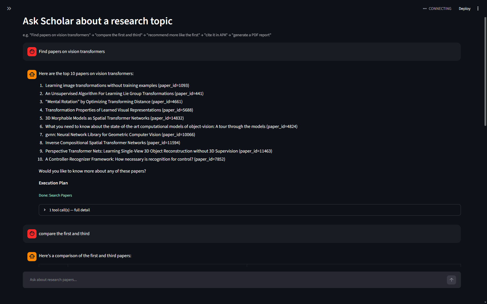
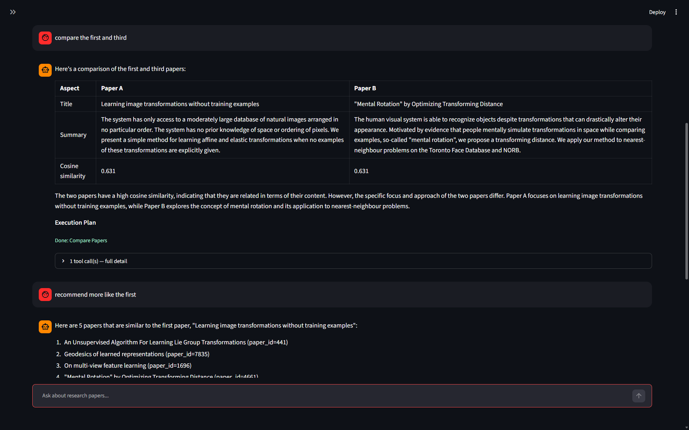
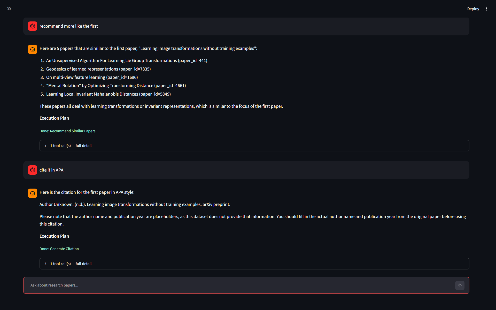
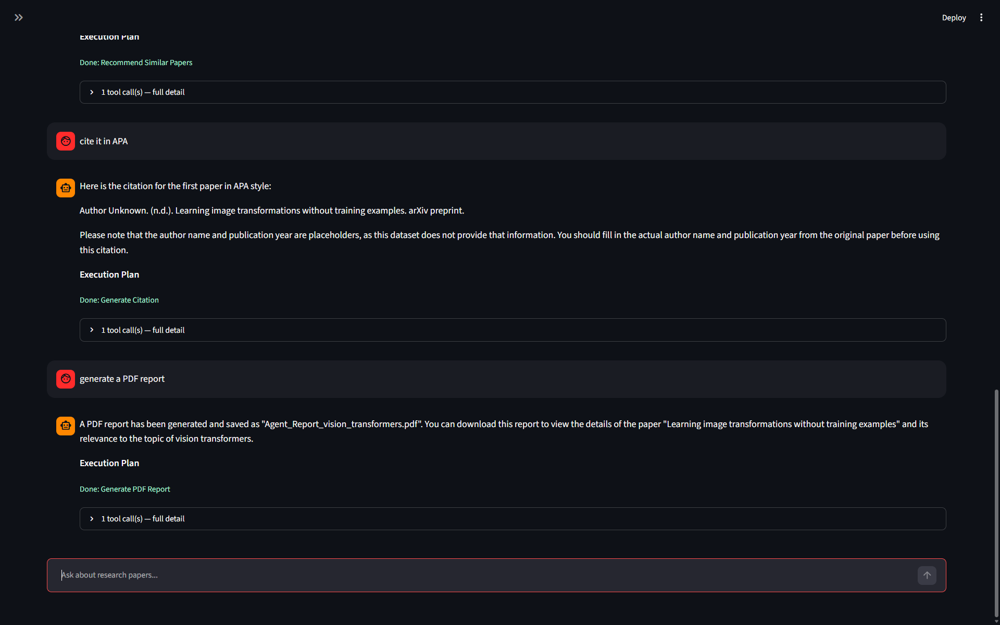

# Agentic Research Assistant


An autonomous, tool-using AI agent for exploring and analyzing research papers. Instead of running a fixed pipeline, a **Planner Agent** (an LLM) decides *which tools to call, in what order, and whether to call them at all* — based on what the user actually asks for.

## How it works

The agent doesn't run every step for every query — it reasons about intent and only invokes the tools it actually needs:

- Ask *"find papers on vision transformers"* → only `search_papers` runs
- Ask *"summarize the first one"* → the agent remembers the paper from the last turn and only calls `summarize_paper`
- Ask *"compare the first and second papers"* → routes to a completely different tool, `compare_papers`
- Ask *"generate a PDF report"* → only now does `generate_report` run

The agent keeps conversation memory across turns, so follow-up questions work naturally.

## Architecture

```
User Query
    |
    v
Planner Agent (Groq Llama 3.1 -- reasons about intent, decides which tools to call)
    |
    +--> search_papers        (FAISS semantic retrieval)
    +--> summarize_paper      (BART abstractive summary)
    +--> extract_keywords     (KeyBERT)
    +--> extract_entities     (NER)
    +--> compare_papers       (compares two papers side by side)
    +--> generate_report      (exports a PDF report)
    |
    v
Final Response (text answer, or a generated PDF)
```

## Features

| Component | Technology |
|---|---|
| Semantic Search | Sentence Transformers + FAISS |
| Summarization | `facebook/bart-large-cnn` |
| Keyword Extraction | KeyBERT |
| Named Entity Recognition | spaCy |
| Agent Orchestration | LangChain (`bind_tools`, tool-calling loop) |
| Planner LLM | Groq — `llama-3.1-8b-instant` |
| Report Export | ReportLab (PDF) |
| Console Output | Rich |

## Getting Started

### 1. Clone the repository

```bash
git clone https://github.com/Sohammahure05/agentic-research-assistant.git
cd agentic-research-assistant
```

### 2. Set up an environment

```bash
python -m venv venv
source venv/bin/activate   # On Windows: venv\Scripts\activate
pip install -r requirements.txt
python -m spacy download en_core_web_sm
```

### 3. Get a Groq API key

Sign up free at [console.groq.com](https://console.groq.com/), create an API key, and set it as an environment variable:

```bash
export GROQ_API_KEY=your_key_here   # Windows PowerShell: $env:GROQ_API_KEY="your_key_here"
```

(In Google Colab, add it under the Secrets tab instead — the notebook detects this automatically.)

### 4. Run the notebook

```bash
jupyter notebook notebooks/agentic_research_assistant.ipynb
```

Run all cells in order, then try the demo queries at the bottom — or write your own.

## Example

```python
run_agent("Find me 3 papers about vision transformers")
run_agent("Summarize the first one")
run_agent("Compare the first and second papers you found earlier")
run_agent("Generate a PDF report for the first paper")
```

## Tech Stack

Python · LangChain · Groq (Llama 3.1) · Sentence Transformers · FAISS · Hugging Face Transformers (BART) · KeyBERT · spaCy · ReportLab · Rich


## 🎬 Demo

The agent handles a full multi-turn research workflow — searching, comparing, recommending, citing, and generating a report — all from natural language queries, without running a fixed pipeline every time.

**1. Search papers on a topic**



The agent finds the most relevant papers using semantic search over the FAISS index, then waits for the next instruction instead of running every tool automatically.

**2. Compare papers in context**



A follow-up query like *"compare the first and third"* is understood in context — the agent remembers which papers were found earlier in the conversation, so there's no need to repeat paper titles or IDs.

**3. Recommend similar papers + generate a citation**



The planner routes each request to the right tool on its own — *"recommend more like the first"* calls `recommend_similar_papers`, while *"cite it in APA"* calls `generate_citation`, all within the same conversation.

**4. Export a PDF report**



A simple prompt like *"generate a PDF report"* triggers `generate_report`, which compiles the paper's summary, keywords, and entities into a downloadable PDF.


## Possible Improvements

- Persist conversation memory to disk (e.g. `MemorySaver` / SQLite) instead of an in-memory list
- Add a `web_search` tool so the agent isn't limited to the local paper database
- Streamlit/Gradio front-end for a chat-style interface
- Structured tool-call logging/tracing for observability and debugging

## License

This project is licensed under the [MIT License](LICENSE).

## Author

**Soham Mahure**

[GitHub](https://github.com/Sohammahure05)
